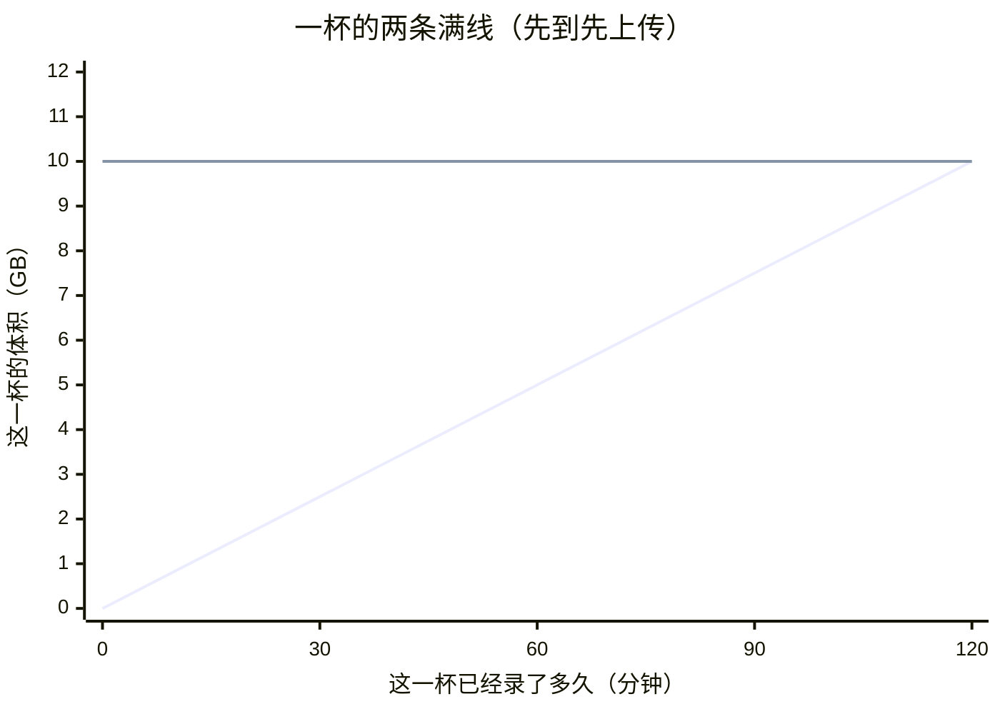
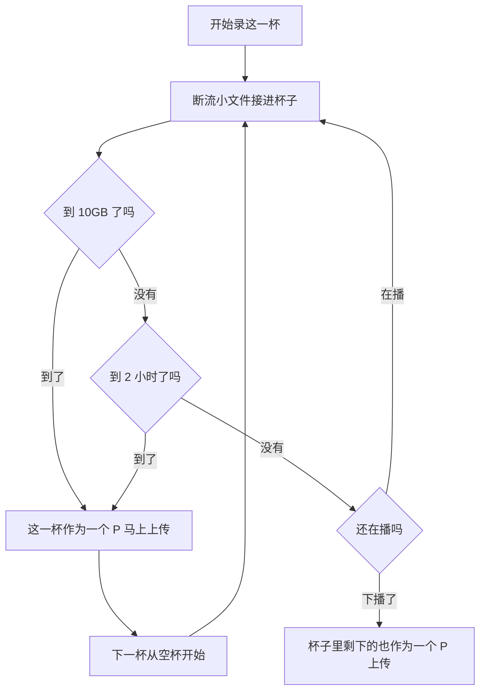

# 一个 P 怎么装满

断流切出来的小文件先留在磁盘上，用 FFmpeg 接进当前这一杯。杯子有两条满线，先碰到哪条，这一杯就是 1 个 P，马上上传。直播还在继续，下一杯从空杯再接。

- 实线：体积，满 **10GB**
- 虚线：时长，满 **2 小时**
- 下播：杯子没满也上传。这一场剩下的小文件合成最后一个 P

体积在 120 分钟碰到 10GB，这一杯就上传。时长先满 2 小时、体积还没到 10GB 时，也上传。

下播不看这两条线。例如下一杯只录了 40 分钟、0.7GB，主播下播，这一杯照样上传。

